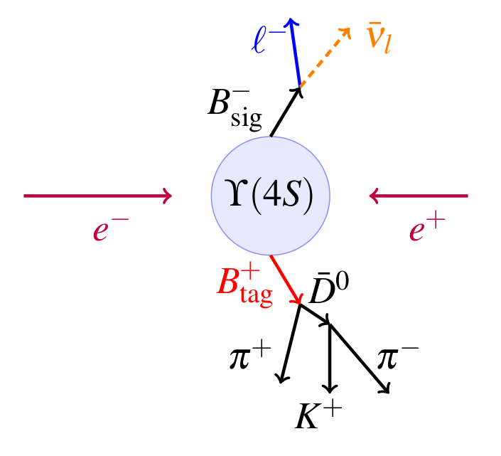
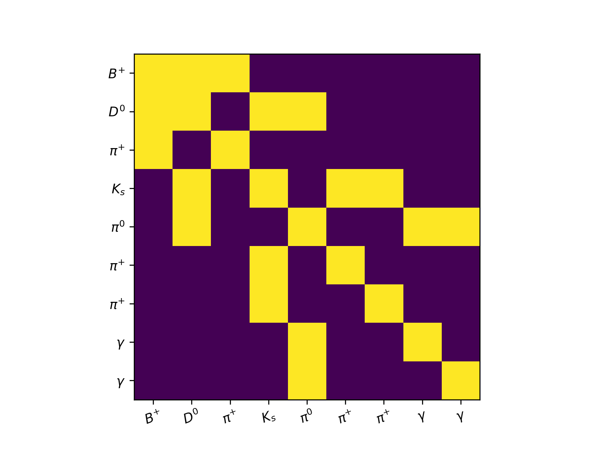
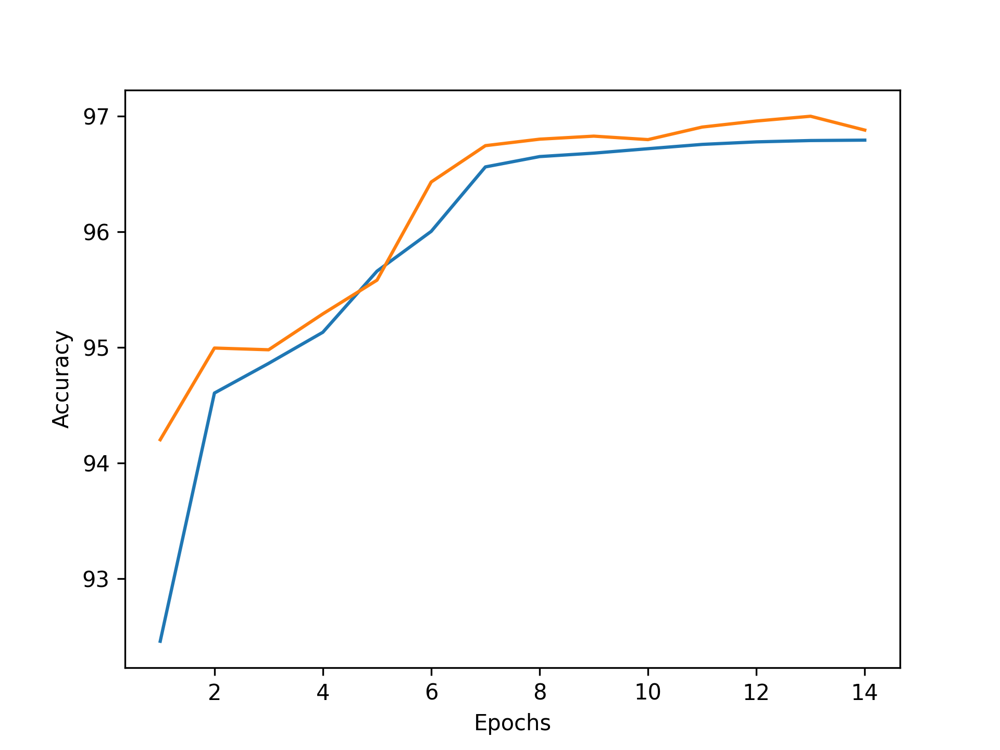

# particle-decay-graphs

Project to classify correctly or incorrectly reconstructed particle decays with deep learning approaches such as graph convolutional networks.

## Motivation

As a member of the Belle II experiment I have been responsible for training, maintaining, calibrating and developing the tag-side reconstruction algorithm This algorithm employs a hierarchical reconstruction of B meson decay chains using around 200 BDTs to classify unique particle decays within the B meson decay chains as being correctly or incorrectly reconstructed. In this project I attempt to replace the B meson BDTs, of which there are 60, with a single deep network.  

  

## Data

  

## Architecture

  

  

