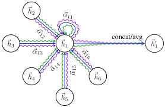

# particle-decay-graphs

Project to classify correctly or incorrectly reconstructed particle decays with deep learning approaches such as graph convolutional networks.

## Motivation

As a member of the Belle II experiment I have been responsible for training, maintaining, calibrating and developing the tag-side reconstruction algorithm. This algorithm employs a hierarchical reconstruction of B meson decay chains using around 200 BDTs to classify unique particle decays within the B meson decay chains as being correctly or incorrectly reconstructed. A full description of the algorithm is found in the following publication of which I am a co-author: https://link.springer.com/article/10.1007/s41781-019-0021-8 

In this project I attempt to replace the B meson BDTs, of which there are 60, with a single deep network.  

## Tag-side reconstruction

At Belle II we study $e^{+} e^{-}$ collisions. The collisions take place at the exact energy required to produce an $\Upsilon(4S)$ particle containing a $b$ quark and a $\bar{b}$ quark. This particle subsequently decays into two $B$ mesons. The role of the tag-side reconstruction algorithm is to reconstruct one of the $B$ mesons, allowing the second $B$ meson to be studied in greater detail. This is illustrated in the figure below. 

<p float="left">
  
</p>

The reconstruction of the tag-side $B$ involves reconstructing a large number of possible decay chains of the $B$ meson. Machine learning is used to classify whether or not reconstructed decays are correct. 

## Data

The data used consisted of around 0.5m (train) and 30k (validation) reconstructed $B$ meson decay chains. For these decay chains there can be a variable number of particles, which represent nodes / vertices in a graph. Meanwhile, mother daughter connections represent edges. For each decay chain various features are stored for the graph nodes such as mass, energy, momenta and particle type. In addition, the adjacency matrix is required, which summarises edge connections in the graph. Below is an example of an adjacency matrix for a decay. 

<p float="left">
  
</p>


## Architecture

While initially I tried a standard graph convolution network with CGNConv of pytorch geometric, which uses a Laplacian formed from the Adjacency matrix, this arhiecture had sub-optimal results. Therefore, I tried an attention-based graph convolutional network using GATConv. This allows for learnable attention weights between the various nodes. 

<p float="left">
  
</p>

The implementation of the graph convolutional attention network is shown below:

```
import torch
import torch.nn.functional as F
from torch_geometric.nn import GCNConv
from torch_geometric.nn import GATConv
from torch_geometric.nn import NNConv, global_mean_pool
from torch import nn

class GCN(torch.nn.Module):
    def __init__(self):
        super().__init__()
        self.hid = 8
        self.in_head = 8
        self.out_head = 1

        self.gconv1 = GATConv(18, self.hid, heads=self.in_head, dropout=0.1)
        self.gconv2 = GATConv(self.hid*self.in_head, 128, concat=False, dropout=0.1)
        self.gconv3 = GATConv(128, 256, concat=False, dropout=0.1)
        self.fc_1 = nn.Linear(256, 128)
        self.fc_2 = nn.Linear(128, 32)
        self.fc_3 = nn.Linear(32, 2)


    def forward(self, data):
        x, edge_index = data.x, data.edge_index

        x = self.gconv1(x, edge_index)
        x = F.relu(x)
        x = self.gconv2(x, edge_index)
        x = F.relu(x)
        x = self.gconv3(x, edge_index)
        x = F.relu(x)
        x = global_mean_pool(x, data.batch)
        x = F.relu(self.fc_1(x))
        x = F.relu(self.fc_2(x))
        x = self.fc_3(x)

        return x
```


# Results 

The plot below summarizes the accuracy of the model for predicting correctly reconstructed decay chains as a function of training epochs. 

<p float="left">
  
</p>

meanwhile the plot below shows the final ROC curve, which is compared to the use of around 60 BDTs.

<p float="left">
  
</p>

The GATConv does outperform the BDTs however the BDTs already have a very high performance so there is not so much room for improvement.
